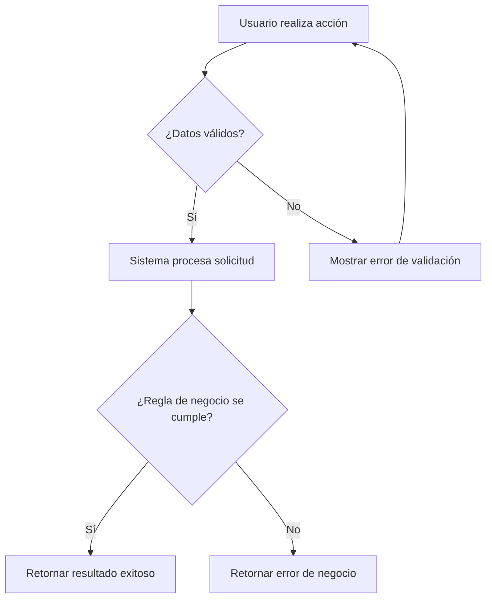
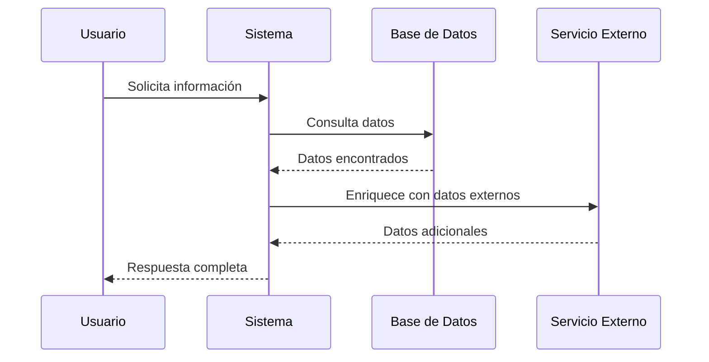
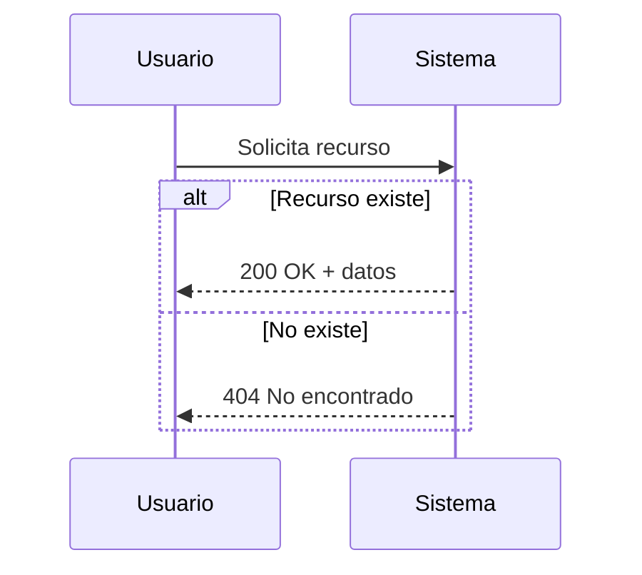

# Guía de Diagramas Mermaid para Documentación Funcional

## Tipos de diagrama a usar

### 1. Flowchart — Flujos de caso de uso

Usar para representar el flujo principal y alternativo de cada caso de uso.

**Convenciones:**
- Rectángulos `["..."]` para acciones.
- Rombos `{"..."}` para decisiones.
- Flechas con etiqueta `-->|Texto|` para condiciones.
- Dirección `TD` (top-down) para flujos lineales.
- Dirección `LR` (left-right) si hay muchas ramas paralelas.

### 2. Sequence Diagram — Integraciones

Usar para representar la comunicación entre el sistema y servicios externos.

**Convenciones:**
- `participant` con alias corto (`U`, `S`, `BD`).
- `->>` para llamadas (línea sólida).
- `-->>` para respuestas (línea punteada).
- Usar `Note over` para aclaraciones.
- Usar `alt`/`else` para flujos condicionales.

### 3. Flujos condicionales en secuencia

## Reglas generales

1. **Simplicidad**: Máximo 10-12 nodos por diagrama. Si es más complejo, dividir en sub-diagramas.
2. **Texto en español**: Los labels deben estar en español y en lenguaje funcional.
3. **Sin terminología técnica**: Decir "Consulta eventos" no "SELECT * FROM eventos". Decir "Verifica permisos" no "Claims validation".
4. **Escapar caracteres**: Usar `["texto"]` en lugar de `[texto]` cuando el texto contiene paréntesis o caracteres especiales.
5. **Validar sintaxis**: El diagrama debe renderizar correctamente en GitHub y VS Code.
