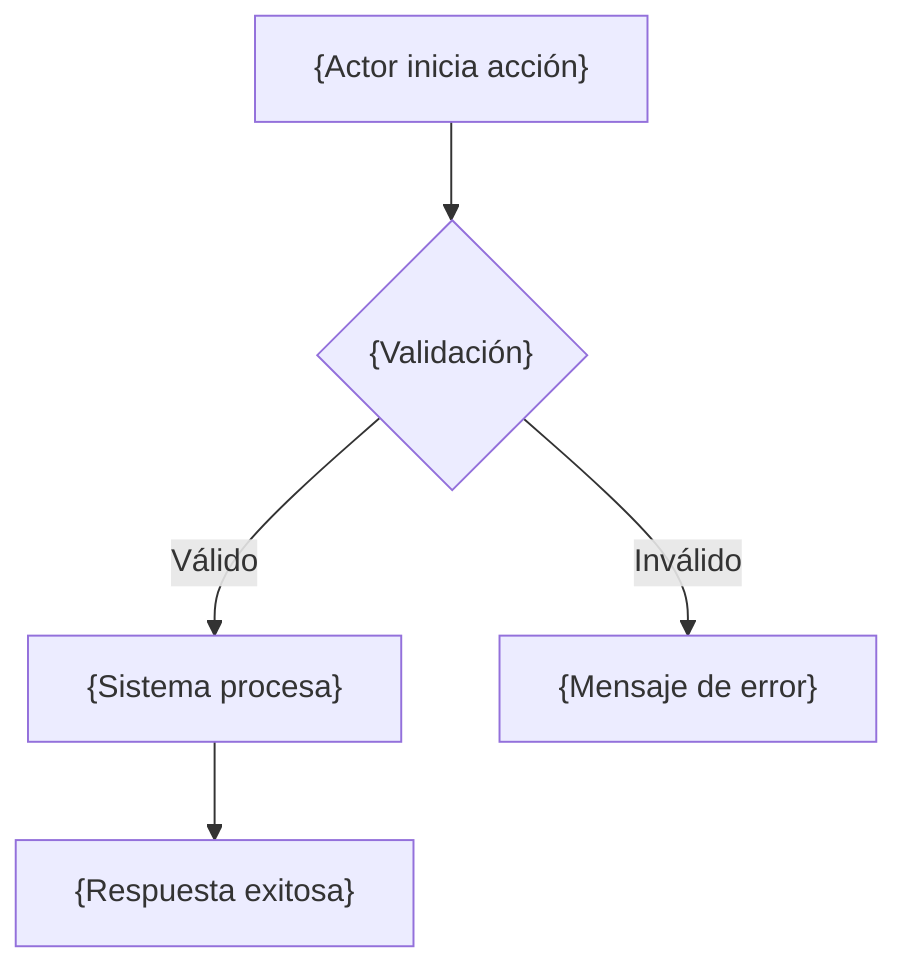
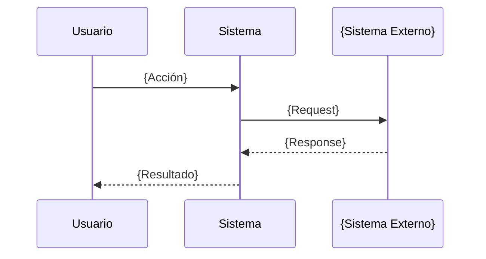

# Documento Funcional — {Nombre del Proyecto}

> Última actualización: {fecha}

---

## Tabla de Contenidos

- [1. Módulos Funcionales](#1-módulos-funcionales)
- [2. Casos de Uso](#2-casos-de-uso)
- [3. Permisos y Roles](#3-permisos-y-roles)
- [4. Integraciones Funcionales](#4-integraciones-funcionales)

---

## 1. Módulos Funcionales

### 1.1 {Nombre del Módulo}

- **Objetivo**: {Qué resuelve funcionalmente}
- **Relación con otros módulos**: {Dependencias funcionales}
- **Features incluidas**:
  - {Feature 1}
  - {Feature 2}

---

## 2. Casos de Uso

### CU-001: {Nombre del Caso de Uso}

**Descripción**
{Qué permite hacer este caso de uso, en 2-3 oraciones.}

**Actores**
- {Actor principal}
- {Actor secundario (si aplica)}

**Precondiciones**
- {Condición 1}
- {Condición 2}

**Flujo Principal**

| Paso | Actor | Sistema |
|------|-------|---------|
| 1 | {Acción del actor} | |
| 2 | | {Respuesta del sistema} |
| 3 | | {Respuesta del sistema} |

**Flujos Alternativos**

- **FA-001** (desde paso {N}): {Descripción de la desviación}
  1. {Paso alternativo 1}
  2. {Paso alternativo 2}
  3. Retorna al paso {N} del flujo principal / Finaliza con {resultado}.

**Reglas de Negocio**

| ID | Descripción | Condición → Resultado |
|----|-------------|----------------------|
| RN-001 | {Nombre de la regla} | {Si [condición] → [resultado]} |

**Validaciones**

| Campo | Regla | Mensaje de Error |
|-------|-------|-----------------|
| {campo} | {regla de validación} | {mensaje que ve el usuario} |

**Datos de Entrada**

| Parámetro | Tipo | Obligatorio | Descripción |
|-----------|------|-------------|-------------|
| {param} | {tipo funcional} | Sí/No | {descripción} |

**Datos de Salida**

```
{Estructura de la respuesta exitosa en formato legible}
```

**Mensajes de Error**

| Código | Mensaje | Causa |
|--------|---------|-------|
| {código} | {mensaje} | {cuándo ocurre} |

**Diagrama de Flujo**



---

## 3. Permisos y Roles

### Roles del Sistema

| Rol | Descripción |
|-----|-------------|
| {Rol A} | {Descripción del rol} |
| {Rol B} | {Descripción del rol} |

### Matriz de Permisos

| Acción / Feature | {Rol A} | {Rol B} | {Rol C} |
|-----------------|---------|---------|---------|
| {CU-001: Feature 1} | ✅ | ❌ | 👁️ |
| {CU-002: Feature 2} | ✅ | ✅ | ❌ |

> Leyenda: ✅ Acceso completo | 👁️ Solo lectura | ❌ Sin acceso

---

## 4. Integraciones Funcionales

### INT-001: {Nombre del Sistema Externo}

| Campo | Detalle |
|-------|---------|
| **Sistema externo** | {Nombre} |
| **Propósito** | {Para qué se comunica} |
| **Dirección** | Entrante / Saliente / Bidireccional |
| **Datos intercambiados** | {Qué información se envía o recibe} |
| **Frecuencia** | Tiempo real / Bajo demanda / Batch / Programado |

**Diagrama de Secuencia**



---

*Documento generado automáticamente. Las secciones marcadas con [inferido] requieren validación del equipo.*
