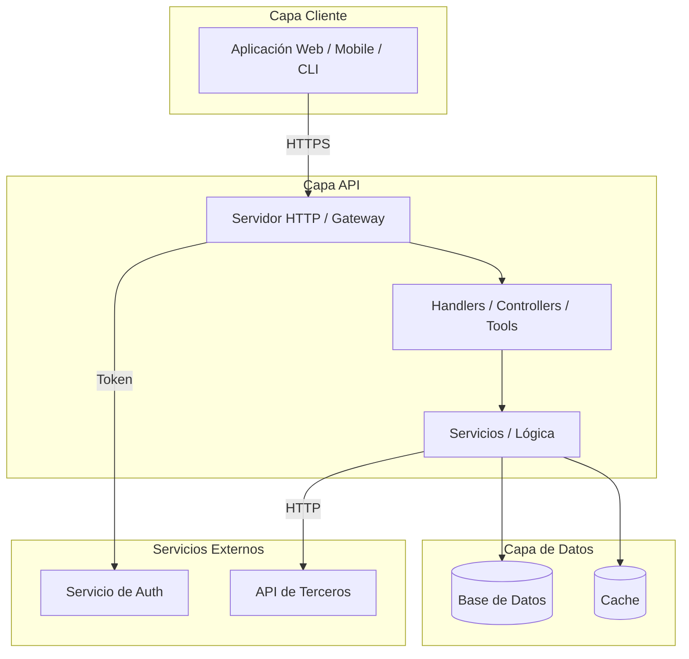
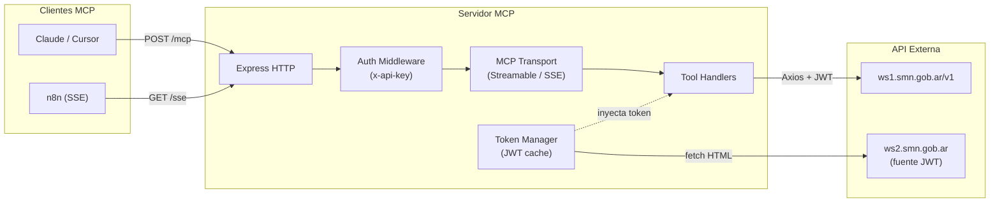
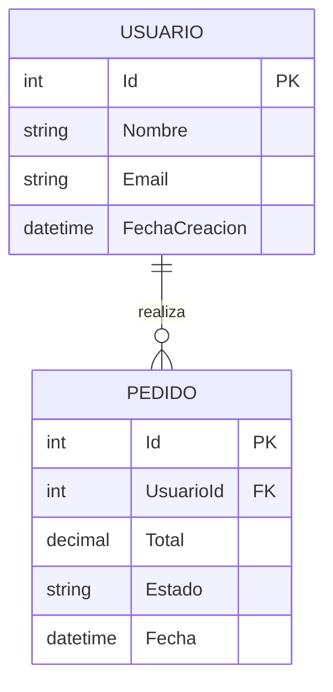
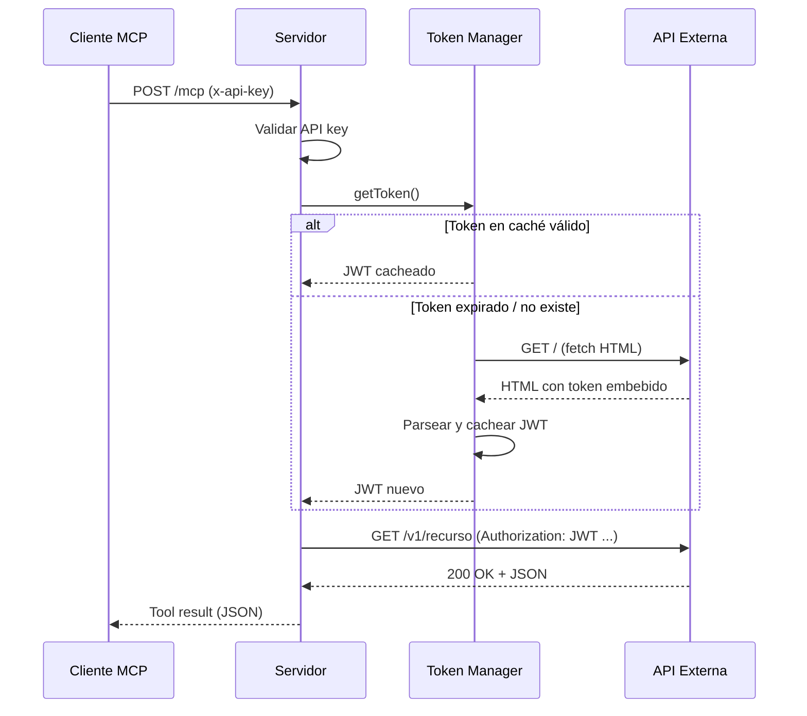
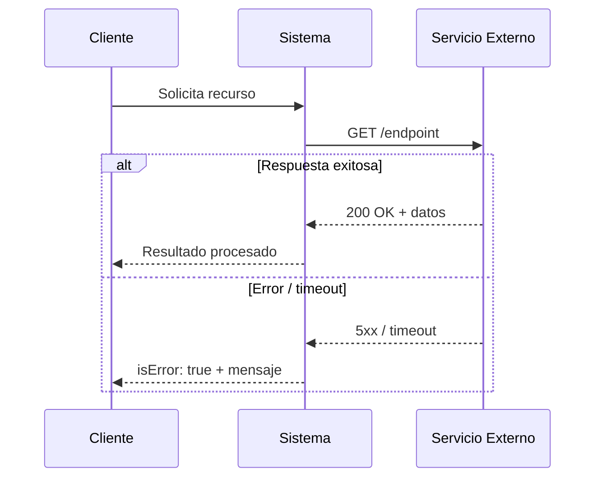

# Guía de Diagramas Técnicos en Mermaid

## Tipos de diagrama a usar

### 1. Flowchart — Arquitectura del Sistema

Representar componentes, capas y flujo de datos.

**Ejemplo: API REST con base de datos**

**Ejemplo: Servidor MCP (stateless, sin base de datos propia)**

**Convenciones:**
- `subgraph` para agrupar por capa o responsabilidad.
- Rectángulos `["..."]` para componentes de aplicación.
- Cilindros `[("...")]` para bases de datos y almacenamiento.
- Flechas con etiqueta de protocolo `-->|HTTPS|`.
- Dirección `TD` (top-down) para arquitecturas en capas.
- Dirección `LR` (left-right) para flujos de datos horizontales.

### 2. erDiagram — Modelo de Datos (proyectos con BD)

Representar entidades, atributos y relaciones. Usar solo si el proyecto tiene base de datos propia.

**Convenciones de cardinalidad:**
- `||--||` → uno a uno
- `||--o{` → uno a muchos (el lado `o{` es el "muchos", `o` = opcional)
- `||--|{` → uno a muchos (obligatorio en ambos lados)
- `}o--o{` → muchos a muchos

**Convenciones de atributos:**
- Incluir `PK` para claves primarias.
- Incluir `FK` para claves foráneas.
- Usar tipos simples: `int`, `string`, `decimal`, `datetime`, `bool`.
- Máximo 6-8 atributos por entidad.

**Para proyectos stateless (sin BD propia):** en lugar de erDiagram, usar un diagrama de flujo o una tabla de tipos de dominio. No forzar un ER donde no hay relaciones.

### 3. Sequence Diagram — Integraciones Técnicas

Representar flujo de comunicación entre sistemas.

**Ejemplo: integración con API externa con auth**

**Ejemplo: flujo con manejo de error**

**Convenciones:**
- `participant` con alias técnico corto.
- `->>` para requests (línea sólida).
- `-->>` para responses (línea punteada).
- Incluir método HTTP y ruta en las llamadas.
- Incluir código de status en las respuestas.
- Usar `alt`/`else` para flujos condicionales.

## Reglas generales

1. **Máximo 12-15 nodos** por diagrama. Si es más complejo, dividir en sub-diagramas.
2. **Nombres técnicos permitidos**: A diferencia del documento funcional, acá sí usar nombres de tecnología (JWT, REST, Axios, Docker, etc.).
3. **Consistencia**: Los nombres de entidades/componentes deben coincidir con los de las tablas descriptivas.
4. **Escapar caracteres**: Usar `["texto"]` para nodos con caracteres especiales o saltos de línea (`\n`).
5. **Validar sintaxis**: El diagrama debe renderizar en GitHub y VS Code sin errores.
6. **No incluir secretos**: Los diagramas muestran rutas y protocolos, nunca tokens, passwords, o connection strings.
