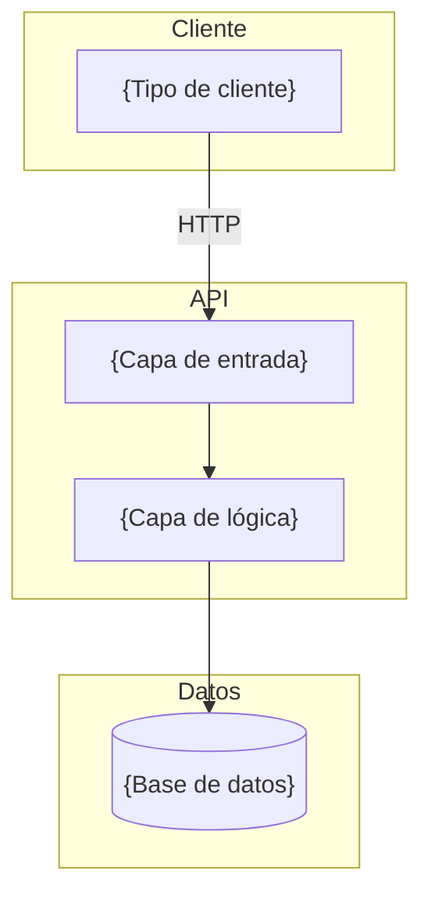
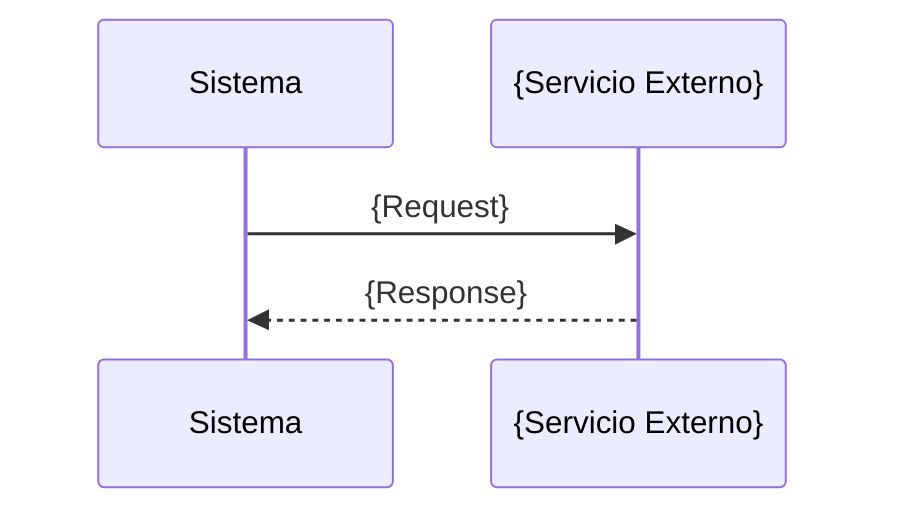
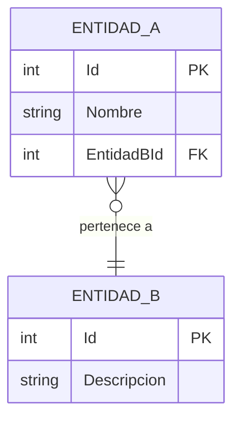

# Documento Tecnológico — {Nombre del Proyecto}

> Última actualización: {fecha}

---

## Tabla de Contenidos

- [1. Arquitectura Aplicada](#1-arquitectura-aplicada)
- [2. Tecnologías Utilizadas](#2-tecnologías-utilizadas)
- [3. Librerías Utilizadas](#3-librerías-utilizadas)
- [4. Infraestructura](#4-infraestructura)
- [5. Seguridad](#5-seguridad)
- [6. Integraciones Técnicas](#6-integraciones-técnicas)
- [7. Modelo de Datos](#7-modelo-de-datos)
- [8. Pruebas](#8-pruebas)
- [9. Limitaciones Técnicas Actuales](#9-limitaciones-técnicas-actuales)

---

## 1. Arquitectura Aplicada

**Patrón**: {Nombre del patrón}

{Breve descripción de por qué se eligió o se infiere este patrón.}

### Componentes Principales

| Componente | Responsabilidad |
|------------|----------------|
| {Componente 1} | {Qué hace} |
| {Componente 2} | {Qué hace} |

### Diagrama de Arquitectura



---

## 2. Tecnologías Utilizadas

| Categoría | Tecnología | Versión | Propósito |
|-----------|------------|---------|-----------|
| Lenguaje | {lenguaje} | {versión} | {propósito} |
| Framework | {framework} | {versión} | {propósito} |
| Base de datos | {BD} | {versión} | {propósito} |
| Runtime | {runtime} | {versión} | {propósito} |

---

## 3. Librerías Utilizadas

### Runtime

| Librería | Versión | Propósito |
|----------|---------|-----------|
| {librería} | {versión} | {propósito} |

### Desarrollo / Test

| Librería | Versión | Propósito |
|----------|---------|-----------|
| {librería} | {versión} | {propósito} |

---

## 4. Infraestructura

### Hosting / Cloud

{Descripción del hosting o indicar [no detectado en el codebase — confirmar con el equipo].}

### Contenedores

{Dockerfile, docker-compose, orquestador, o [no detectado].}

### CI/CD

{Pipelines detectados, etapas, triggers, o [no detectado].}

### Monitoreo y Logging

| Herramienta | Propósito | Configuración |
|-------------|-----------|---------------|
| {herramienta} | {logging / métricas / tracing} | {nivel, destino} |

---

## 5. Seguridad

| Aspecto | Implementación |
|---------|----------------|
| Autenticación | {mecanismo} |
| Autorización | {mecanismo} |
| Encriptación | {en tránsito / en reposo / ambos} |
| Manejo de secretos | {mecanismo} |
| Políticas de backup | {detectado / no detectado} |
| CORS | {configuración} |
| HTTPS | {forzado / opcional / no detectado} |

---

## 6. Integraciones Técnicas

### INT-001: {Nombre del Servicio}

| Campo | Detalle |
|-------|---------|
| **Servicio** | {nombre} |
| **Protocolo** | {HTTP REST / gRPC / WebSocket / AMQP} |
| **Endpoint base** | {URL patrón, sin secretos} |
| **Formato de datos** | {JSON / XML / Protobuf} |
| **Autenticación** | {Bearer / API Key / mTLS} |
| **Dirección** | {Consumo / Exposición / Bidireccional} |



---

## 7. Modelo de Datos / Tipos de Dominio

> Completar la opción que aplique según el proyecto:

### Opción A — Proyectos con base de datos: Diagrama ER



#### Detalle de Entidades

| Columna | Tipo | Nullable | Clave | Descripción |
|---------|------|----------|-------|-------------|
| {columna} | {tipo} | Sí/No | PK / FK a {X} / — | {descripción} |

### Opción B — Proyectos stateless (sin base de datos propia): Tipos de Dominio

Describir las estructuras de datos que el sistema produce y consume.

#### Tipos principales

| Tipo / Interface | Origen | Propósito |
|-----------------|--------|-----------|
| `{NombreTipo}` | {Definición propia / API externa} | {Para qué se usa} |

#### Estructura de tipos clave

```
{NombreTipo} {
  campo1: tipo    // descripción
  campo2: tipo    // descripción
}
```

### Enums / Diccionarios de dominio

| Nombre | Valores | Uso |
|--------|---------|-----|
| `{NombreEnum}` | `{Valor1}`, `{Valor2}`, ... | {Dónde se usa} |

---

## 8. Pruebas

| Tipo | Framework | Cobertura | Ubicación |
|------|-----------|-----------|-----------|
| Unitarios | {framework} |  / No medida | {ruta} |
| E2E | {framework} | {%} / No medida | {ruta} |

{Si no hay pruebas, indicarlo como limitación técnica en la sección 9.}

---

## 9. Limitaciones Técnicas Actuales

| # | Descripción | Impacto | Severidad |
|---|-------------|---------|-----------|
| 1 | {Descripción específica} | {Performance / Escalabilidad / Mantenibilidad / Seguridad} | Alta / Media / Baja |
| 2 | {Descripción específica} | {área afectada} | Alta / Media / Baja |

---

*Documento generado automáticamente. Las secciones marcadas con [inferido] o [no detectado] requieren validación del equipo.*
